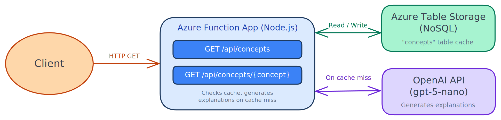

# Lingo Lexicon API 📖

## Overview
Lingo Lexicon API is a serverless REST API built with Node.js and Azure Functions that explains technical concepts professionally and in plain language. On first request, explanations are generated via the OpenAI API and stored in Azure Table Storage. Subsequent requests are served directly from storage, making responses instant.

## Architecture

The API is built on Azure Functions (Flex Consumption) and uses Azure Table Storage (NoSQL) as a persistent store. When a concept is requested for the first time, the function calls the OpenAI API in parallel to generate both a professional and a plain-language explanation, saves the result to Table Storage, and returns it to the client. All subsequent requests for the same concept are served directly from storage.



## API Endpoints

| Method | Endpoint | Description | Response |
|--------|----------|-------------|----------|
| `GET` | `/api/concepts` | Returns a list of all stored concept names | `["PHP", "Laravel", "CAP Theorem"]` |
| `GET` | `/api/concepts/{concept}` | Returns professional and plain-language explanations for a concept. Generated via OpenAI on first request, served from storage thereafter | `{ "concept", "professional", "plain", "cached" }` |

### Tech Stack

- **[Azure Functions](https://learn.microsoft.com/en-us/azure/azure-functions/)** — Flex Consumption, Node.js v4 programming model.
- **[Azure Table Storage](https://learn.microsoft.com/en-us/azure/storage/tables/)** — NoSQL storage for concept explanations.
- **[OpenAI API](https://developers.openai.com/api/docs)** — GPT-4o for generating explanations.
- **[GitHub Actions](https://docs.github.com/en/actions)** — CI/CD pipeline for automated deployment.

## Local Development

### Prerequisites
- [Node.js](https://nodejs.org/) v22+.
- [Azure Functions Core Tools](https://learn.microsoft.com/en-us/azure/azure-functions/functions-run-local) v4.
- An Azure Storage account.
- An OpenAI API key.

### Setup

1. Clone the repository:
   ```bash
   git clone git@github.com:rheannemcintosh/lingo-lexicon-api.git
   cd lingo-lexicon-api
   ```

2. Install dependencies:
   ```bash
   npm install
   ```

3. Copy the example settings file and fill in your values:
   ```bash
   cp local.settings.json.example local.settings.json
   ```

4. Start the function app:
   ```bash
   func start
   ```

### Testing Locally

Once running, the function app is available at `http://localhost:7071`. You can test the endpoints using curl or a tool like Postman.

1. List all concepts:
   ```bash
   curl "http://localhost:7071/api/concepts"
   ```

2. Fetch a concept (generates via OpenAI on first request):
   ```bash
   curl "http://localhost:7071/api/concepts/PHP"
   ```

### Environment Variables

| Variable | Description |
|----------|-------------|
| `AzureWebJobsStorage` | Azure Storage connection string used internally by the Functions runtime |
| `FUNCTIONS_WORKER_RUNTIME` | Runtime language for the function app — set to `node` |
| `STORAGE_CONNECTION_STRING` | Azure Table Storage connection string for the `concepts` table |
| `OPENAI_API_KEY` | OpenAI API key for generating concept explanations |

## Deployment

The project deploys automatically to Azure Functions (Flex Consumption) via GitHub Actions on every push to `main`. To configure deployment, add an `AZURE_CREDENTIALS` secret to your GitHub repository containing a Service Principal with Contributor access to the Function App's resource group.

## Tools & Technologies


